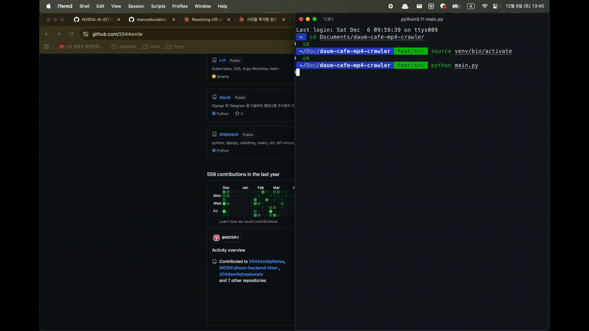
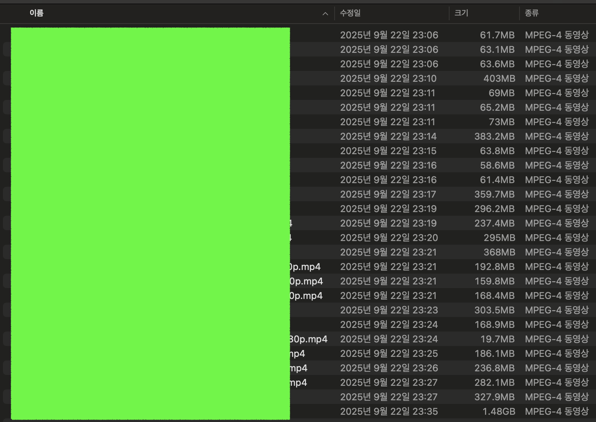

# DAUM-CAFE-MP4-CRAWLER




## 모듈화

- 단일 파일에서 기능별로 분리된 모듈 구조로 리팩토링했습니다.

### src/browser/ - 브라우저 제어

브라우저 드라이버 생성 및 네비게이션을 담당하는 모듈입니다.

- **driver.py** - 브라우저 드라이버 초기화
  - `create_driver()`: Chrome + Selenium Wire 드라이버 생성
    - Selenium Wire 프록시 설정으로 모든 네트워크 요청 캡처 가능
    - Chrome 옵션 자동 적용 (--disable-web-security, --no-sandbox 등)
    - webdriver-manager로 ChromeDriver 자동 다운로드 및 설정
  - `create_wait()`: WebDriverWait 객체 생성 (요소 대기용)

- **navigator.py** - 페이지 네비게이션 및 iframe 제어
  - `Navigator` 클래스: **브라우저 이동** 및 iframe 전환 담당
    - `.goto(url, delay)`: 특정 URL로 이동 후 지정 시간 대기
    - `.back(delay)`: 이전 페이지로 돌아가기
    - `.switch_to_iframe(iframe_name)`: name/id로 iframe 전환
    - `.switch_to_iframe_by_index(index)`: 인덱스로 iframe 전환
    - `.find_and_switch_to_board_iframe(candidates)`: 게시판 iframe 자동 탐지 및 전환
      - 여러 iframe 중에서 `article-list` 요소가 있는 iframe을 찾아 전환
      - name으로 찾기 실패 시 인덱스로 순회하며 재시도

### src/auth/ - 인증

카카오 계정 로그인을 처리하는 모듈입니다.

- **login.py** - 카카오 로그인 자동화
  - `login_to_kakao(driver)`: 카카오 로그인 전체 프로세스 수행
    - .env 파일에서 ID/PW 로드 (DaumCafeConfig)
    - WebDriverWait으로 각 입력 필드가 클릭 가능할 때까지 대기
    - ID 입력 → PW 입력 → 로그인 버튼 클릭 → 10초 대기
    - 성공/실패 여부를 bool로 반환

### src/scraper/ - 웹 스크래핑

다음 카페 게시판의 게시글 목록을 수집하는 모듈입니다.

- **board.py** - 게시판 게시글 목록 스크래핑
  - `BoardScraper` 클래스: 게시판 페이지에서 게시글 행(row) 추출
    - `get_post_rows()`: 현재 페이지의 모든 게시글 행 가져오기
      - 여러 CSS 선택자를 순차적으로 시도 (카페마다 HTML 구조 다름)
      - `#article-list tbody tr:not(.state_info)` 등 4가지 선택자 시도
    - `wait_for_page_load(delay)`: 페이지 로딩 대기

- **post.py** - 게시글 정보 추출
  - `extract_post_url_and_title(row)`: 게시글 행에서 URL과 제목 추출
    - 제목 셀 찾기: 여러 선택자 시도 (.td_title, .title, td:nth-child(3) 등)
    - 링크 요소에서 href와 텍스트 추출
    - 유효한 게시글 URL 패턴 검증 (bbs_read, read, view, article 포함)
    - 추출 실패 시 (None, None) 반환

- **pagination.py** - 페이지네이션 처리
  - `Paginator` 클래스: 게시판 페이지 이동 담당
    - `goto_page(page_num)`: 특정 페이지 번호로 이동
      - 페이지 번호 링크를 찾아서 클릭
      - 여러 CSS 선택자로 페이지 버튼 탐색
    - `has_next_page(current_page)`: 다음 페이지 존재 여부 확인
      - 다음 페이지 번호 링크 확인
      - "다음" 버튼 활성화 상태 확인

### src/analyzer/ - 네트워크 분석

**Selenium Wire로 캡처한 네트워크 요청에서 비디오 스트림 URL을 파싱하는 모듈입니다.**

- **network.py** - 네트워크 요청 캡처 및 분석
  - `NetworkAnalyzer` 클래스: 브라우저 네트워크 요청 모니터링
    - `get_initial_request_count()`: 현재 네트워크 요청 개수 저장 (기준점)
    - `capture_requests(initial_count)`: 기준점 이후 새로운 요청들만 추출
    - `trigger_video_elements()`: 페이지 내 비디오 요소 재생 시도
      - video 태그 찾아서 자동 재생 → 네트워크 요청 유발
    - `wait_for_kamp_requests(initial_count, max_retries)`: kamp.daum.net 요청 대기
      - 비디오 스트림 정보는 kamp 요청의 응답에 포함됨
      - 최대 5회 재시도하며 kamp 요청 완료 대기

- **stream_parser.py** - 스트림 URL 파싱 (가장 복잡한 모듈)
  - `StreamParser` 클래스: 네트워크 요청에서 480p MP4 URL 추출
    - `parse_requests(requests)`: 전체 파싱 로직 수행
      - 요청들을 타입별로 분류 (MP4, HLS, DASH, kamp 등)
      - kamp 요청 파싱 → Daum 비디오 URL 검색 → 일반 MP4 검색 순으로 진행
    - `_parse_kamp_requests(kamp_requests)`: kamp.daum.net 응답 파싱
      - gzip 압축 해제 처리
      - JSON에서 streams 데이터 추출
    - `_decompress_response(response)`: gzip 압축된 응답 해제
    - `_parse_streams_json(body, request_index)`: JSON 파싱 시도
    - `_parse_streams_list(streams)`: streams가 배열인 경우 처리
      - name='480p', protocol='mp4' 조건으로 정확한 매칭
      - URL에서 480p 패턴 찾기 (백업 로직)
    - `_parse_streams_dict(streams)`: streams가 딕셔너리인 경우 처리
    - `_parse_streams_raw(body)`: JSON 파싱 실패 시 정규식으로 URL 추출
      - 패턴: `https?://[^\s"']+480[pP][^\s"']*\.mp4[^\s"']*`
    - `_search_daum_video_urls(requests)`: 모든 요청에서 Daum 비디오 URL 검색
      - play.daum.net, kdnv-skb-orisa-edge.play.daum.net 도메인 확인
      - orisa-token 포함된 MP4 URL도 수집

### src/downloader/ - 다운로드

비디오 파일을 실제로 다운로드하는 모듈입니다.

- **downloader.py** - 비디오 다운로드 실행
  - `VideoDownloader` 클래스: 게시글 분석 + 비디오 다운로드 통합
    - `analyze_and_download(post_url, post_title)`: 전체 다운로드 프로세스
      - NetworkAnalyzer로 네트워크 요청 캡처
      - StreamParser로 480p MP4 URL 추출
      - requests 라이브러리로 스트리밍 다운로드 (chunk 단위)
      - 진행률 표시 (다운로드 크기 / 전체 크기)
      - 다운로드 성공/실패 통계 출력

- **filename.py** - 파일명 처리
  - `sanitize_filename(filename)`: 파일명을 안전하게 변환
    - 파일 시스템에서 금지된 문자 제거 (/, \, :, *, ?, ", <, >, | 등)
    - 모두 언더스코어(_)로 치환

### src/utils/ - 유틸리티

공통 유틸리티 함수를 제공하는 모듈입니다.

- **logger.py** - 로깅 설정 (확장 가능)
  - `setup_logger(name)`: Python logging 모듈 설정
    - 콘솔 출력 + 파일 저장 (logs/crawler.log)
    - 로그 레벨: INFO (config/settings.py에서 설정 가능)
    - 현재는 print() 사용 중, 필요시 logger로 전환 가능

### main.py - 메인 엔트리포인트

모든 모듈을 조합하여 실행하는 메인 스크립트입니다.

```python
from src.browser import create_driver, Navigator
from src.auth import login_to_kakao
from src.scraper import BoardScraper, Paginator, extract_post_url_and_title
from src.downloader import VideoDownloader
```

**실행 흐름:**
1. 브라우저 초기화 (create_driver)
2. 카카오 로그인 (login_to_kakao)
3. 카페 및 게시판으로 이동 (Navigator)
4. iframe 찾기 및 전환 (Navigator.find_and_switch_to_board_iframe)
5. 모든 페이지 순회 (Paginator)
6. 각 게시글마다:
   - URL/제목 추출 (extract_post_url_and_title)
   - 게시글 분석 및 다운로드 (VideoDownloader.analyze_and_download)
   - 게시판으로 복귀 (Navigator.back)
7. 브라우저 종료

## Q&A

### 왜 Selenium을 사용하지 않고 **Selenium Wire**를 사용할까?

- Selenium
  - 브라우저를 "조작"만 할 수 있다 (클릭, 입력, 스크롤 등)
  - 브라우저가 어떤 네트워크 요청을 보내는지 볼 수 없다
- Selenium Wire
  - 브라우저와 인터넷 사이에 중간 감시자(프록시)를 놓는다
  - 브라우저 -> [Selenium Wire 프록시] -> 인터넷
    - 프록시에서 모든 요청/응답을 가로채서 기록

#### with code

- 브라우저가 kamp.daum.net에 요청을 보내서 480p MP4 URL 정보를 받아온다
- **Selenium Wire는 프록시로 모든 네트워크 트래픽을 감시하므로 driver.requests로 모든 요청 내역을 확인할 수 있다**

```python
# network.py
new_requests = self.driver.requests[initial_count:]  # 새로운 요청들 확인
for request in new_requests:
  if 'kamp.daum.net' in request.url:
    # request.response.body 에서 480p URL 추출
```

### iframe

- 페이지 안의 또 다른 페이지 다음 카페는 복잡한 구조를 가지고 있었다..
  - Selenium은 기본적으로 메인 페이지만 볼 수 있다 **게시글 목록은 iframe 안에 있어서 접근할 수가 없었다..**
- 그래서 게시글 데이터를 가져오려면 iframe으로 먼저 전환해야 게시글들을 볼 수 있다
  - `navigator.switch_to_iframe("down") # iframe 안으로 들어감`
  - `posts = driver.find_elements(By.CSS_SELECTOR, "#article-list tbody tr")`
- id값이 문자열 형태로 저장될 수 있지만 그렇지 않은 경우에는 0,1,2 순서로 번호가 매겨진다

### Selenium

- WebDriverWait(browser, 10)
  - 브라우저에서 최대 10초까지 특정 조건을 기다리는 객체 생성
- id_input = wait.until(EC.element_to_be_clickable((By.NAME, "loginId")))
  - EC(Expected Conditions; 예상 조건)
  - HTML에서 <input name="loginId"> 태그를 찾음
  - 단순히 존재하는 것이 아니라 **클릭 가능한 상태**까지 기다림
    - 클릭 가능한 상태 = 요소가 보이고(visible) + 활성화되어 있음(enabled)
  - .clear()
    - 입력 필드에 기존에 입력되어 있던 텍스트를 삭제
  - .send_keys()
    - 새로운 값 입력

## 라이브러리

### Selenium + selenium-wire

- `selenium`: 웹 브라우저 자동화 (로그인, 클릭, **iframe** 전환 등)
- `selenium-wire`: **브라우저 네트워크 요청 추적 가능**

### webdriver_manager

- 자동으로 크롬 드라이버 다운로드 및 실행 경로 지정
- 개발환경에 따라 크롬 드라이버 버전을 직접 맞추지 않아도 됨

### dotenv

- `.env` 파일을 불러와서 환경 변수 관리
  - KAKAO_ID=
  - KAKAO_PASSWORD=\
  - LOGIN_URL=https://logins.daum.net/accounts/logout.do?url=https%3A%2F%2Fwww.daum.net
  - TARGET_CAFE_URL=https://cafe.daum.net/2044smile

### installed

- selenium
- seleniumwire
- webdriver-manager